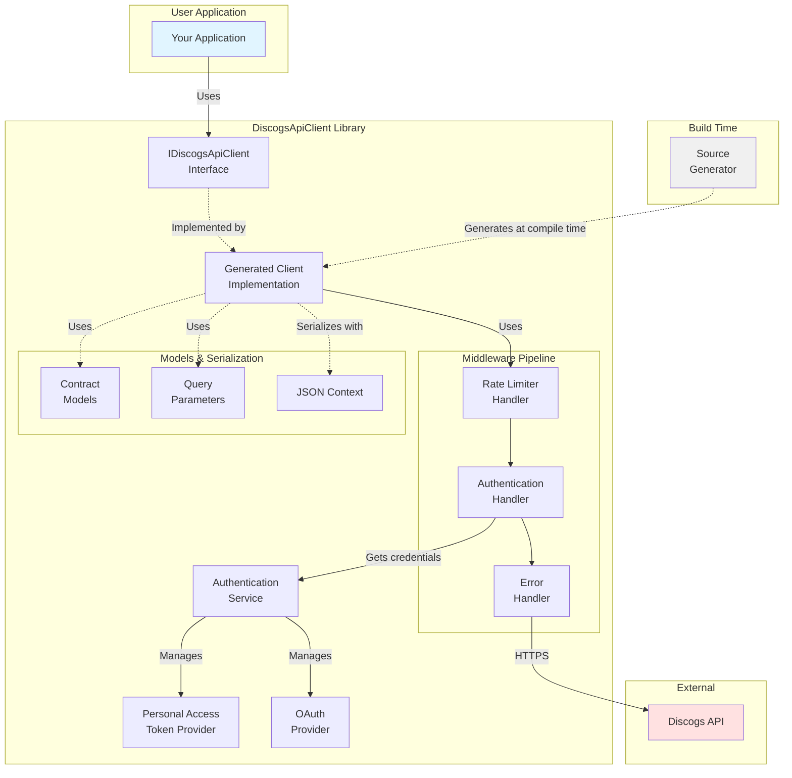
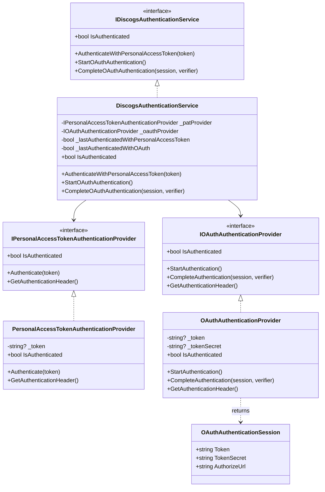
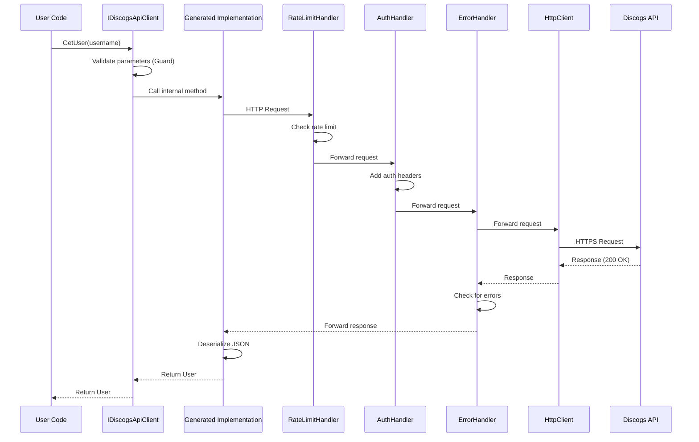
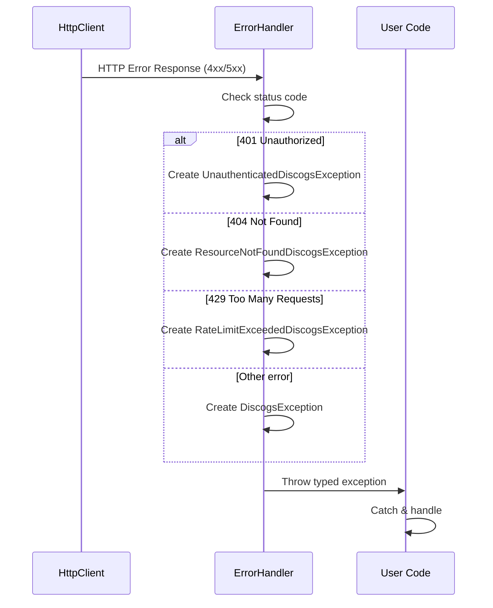

# Architecture

This document describes the architecture and design of the DiscogsApiClient library.

## Overview

DiscogsApiClient is a strongly-typed .NET library for accessing the Discogs API v2. It uses **C# Source Generators** to automatically generate HTTP client code from interface definitions, providing a type-safe and AOT-compatible API surface.

**Key Features:**
- Source Generator-based client implementation
- Multiple authentication methods (Personal Access Token, OAuth 1.0a)
- Built-in rate limiting and error handling
- Native AOT compatibility
- System.Text.Json with source-generated serialization
- Multi-targeting (.NET 6, 7, 8)

---

## High-Level Architecture



---

## Project Structure

```
DiscogsApiClient/
├── src/
│   ├── DiscogsApiClient/                    # Main library
│   ├── DiscogsApiClient.SourceGenerator/    # Source generator project
│   └── DiscogsApiClient.Tests/              # Unit tests
├── demo/                                     # Demo applications
│   ├── DiscogsApiClientDemo.AotConsole/
│   ├── DiscogsApiClientDemo.OAuth/
│   ├── DiscogsApiClientDemo.PersonalAccessToken/
│   ├── DiscogsApiClientDemo.PlainOAuth/
│   └── DiscogsApiClientDemo.UserToken/
└── docs/                                     # Documentation
    ├── API_COVERAGE.md                       # API endpoint coverage tracking
    └── Documentation.html                    # Discogs API reference (saved locally)
```

---

## Core Components

### 1. API Client Interface (`IDiscogsApiClient`)

**Location:** `DiscogsApiClient/IDiscogsApiClient.cs`

The primary interface defining all API operations. Decorated with `[ApiClient]` attribute to trigger source generation.

**Key Patterns:**
- Internal methods with HTTP attributes (`[HttpGet]`, `[HttpPost]`, `[HttpPut]`, `[HttpDelete]`)
- Public wrapper methods with parameter validation
- Async/await throughout with `CancellationToken` support
- Guard clauses using `CommunityToolkit.Diagnostics`

**Example:**
```csharp
[HttpGet("/users/{username}")]
internal Task<User> GetUserInternal(string username, CancellationToken cancellationToken = default);

public async Task<User> GetUser(string username, CancellationToken cancellationToken = default)
{
    Guard.IsNotNullOrWhiteSpace(username);
    return await GetUserInternal(username, cancellationToken);
}
```

### 2. Source Generator (`DiscogsApiClient.SourceGenerator`)

**Location:** `DiscogsApiClient.SourceGenerator/`

An incremental source generator that analyzes interface definitions and generates the actual HTTP client implementation.

**Components:**
- **Parser** - Parses `IDiscogsApiClient` interface and methods
- **Generators** - Generates client implementation, query parameter serialization, and method bodies
- **Attributes** - Custom attributes for API definition (`[ApiClient]`, `[HttpGet]`, `[Body]`, etc.)

**Generated Code:**
- Concrete implementation of `IDiscogsApiClient`
- HTTP request construction
- URL building with route/query parameters
- Response deserialization

**Key Classes:**
- `ApiClientSourceGenerator` - Main generator entry point
- `ApiClientParser` - Parses interface declarations
- `ApiMethodParser` - Parses method declarations
- `ApiClientGenerator` - Generates client class
- `ApiMethodGenerator` - Generates HTTP method implementations
- `QueryParameterGenerator` - Generates query string serialization

### 3. Authentication System

**Location:** `DiscogsApiClient/Authentication/`

Provides multiple authentication strategies:

#### Personal Access Token
**Classes:** 
- `IPersonalAccessTokenAuthenticationProvider`
- `PersonalAccessTokenAuthenticationProvider`

Simple token-based authentication using `Authorization: Discogs token={token}` header.

#### OAuth 1.0a (Plain)
**Classes:**
- `IOAuthAuthenticationProvider`
- `OAuthAuthenticationProvider`
- `OAuthAuthenticationSession`

Full OAuth 1.0a flow implementation:
1. Request token acquisition
2. User authorization (external browser)
3. Access token exchange using verifier

**Note:** Uses plain (unencrypted) OAuth as recommended by Discogs since all requests are over HTTPS.

#### Authentication Service
**Class:** `DiscogsAuthenticationService`

Facade that manages authentication state and provides unified access to authentication providers.

#### Authentication Class Diagram



### 4. HTTP Middleware Pipeline

**Location:** `DiscogsApiClient/Middleware/`

Custom `DelegatingHandler` implementations for cross-cutting concerns:

#### `AuthenticationDelegatingHandler`
- Adds authentication headers to outgoing requests
- Delegates to active authentication provider

#### `ErrorHandlingDelegatingHandler`
- Intercepts HTTP error responses
- Translates to domain-specific exceptions
- Maps 401 → `UnauthenticatedDiscogsException`
- Maps 404 → `ResourceNotFoundDiscogsException`
- Maps 429 → `RateLimitExceededDiscogsException`

#### `RateLimitedDelegatingHandler`
- Enforces rate limiting using `System.Threading.RateLimiting`
- Configurable sliding window rate limiter
- Prevents API throttling

**Pipeline Order:**
```
Request → RateLimiting → Authentication → ErrorHandling → HttpClient → API
```

### 5. Contract Models

**Location:** `DiscogsApiClient/Contract/`

Data Transfer Objects (DTOs) organized by domain:
- `Artist/` - Artist and artist release models
- `Label/` - Label and label release models
- `Release/` - Release, master release, ratings, stats
- `User/` - User profile, identity, collection, wantlist
- `Search/` - Search query and result models

**Characteristics:**
- Immutable record types with init-only properties
- JSON source generation compatible
- Nullable reference types enabled
- Enum converters for string/int mapping

### 6. Serialization

**Location:** `DiscogsApiClient/DiscogsJsonSerializerContext.cs`

Uses `System.Text.Json` source generation for AOT compatibility:
- `[JsonSerializable]` attributes for all contract types
- `DiscogsJsonSerializerContext` for metadata
- Custom enum converters generated via source generator

### 7. Query Parameters

**Location:** `DiscogsApiClient/QueryParameters/`

Strongly-typed query parameter models:
- `PaginationQueryParameters` - Page/per_page
- `SearchQueryParameters` - Database search filters
- `CollectionFolderReleaseSortQueryParameters` - Collection sorting
- `ArtistReleaseSortQueryParameters` - Artist release sorting
- `MasterReleaseVersionFilterQueryParameters` - Master version filtering

Serialized to query strings by source generator.

### 8. Dependency Injection

**Location:** `DiscogsApiClient/ServiceCollectionExtensions.cs`

Extension methods for `IServiceCollection`:

```csharp
services.AddDiscogsApiClient(options =>
{
    options.UserAgent = "MyApp/1.0";
    options.ConsumerKey = "...";      // For OAuth
    options.ConsumerSecret = "...";   // For OAuth
    options.UseRateLimiting = true;
    options.RateLimitingPermits = 60;
    options.RateLimitingWindow = TimeSpan.FromMinutes(1);
});
```

**Registered Services:**
- `IDiscogsApiClient` (Scoped, via HttpClient)
- `IDiscogsAuthenticationService` (Singleton)
- Authentication providers (Singleton/Scoped)
- Middleware handlers (Transient)
- Rate limiter (Singleton, if enabled)

---

## Design Patterns

### 1. Source Generator Pattern
- **What:** Compile-time code generation from interface definitions
- **Why:** Type safety, AOT compatibility, reduced reflection overhead
- **Trade-off:** Longer compile times, generated code debugging

### 2. Middleware Pattern (Delegating Handlers)
- **What:** Chain of responsibility for HTTP request/response processing
- **Why:** Separation of concerns, composable pipeline
- **Implementation:** ASP.NET Core `DelegatingHandler`

### 3. Facade Pattern
- **What:** `DiscogsAuthenticationService` provides unified interface
- **Why:** Simplifies switching between authentication methods
- **Alternative:** Could expose providers directly

### 4. Guard Clause Pattern
- **What:** Early parameter validation in public methods
- **Why:** Fail fast, clear error messages
- **Library:** `CommunityToolkit.Diagnostics`

### 5. Internal/Public Method Pair
- **What:** Internal method with attributes, public wrapper with validation
- **Why:** Separates generated code concerns from validation logic
- **Pattern:**
  ```csharp
  [HttpGet("...")]
  internal Task<T> InternalMethod(...);

  public async Task<T> PublicMethod(...)
  {
      // Validation
      return await InternalMethod(...);
  }
  ```

---

## Data Flow

### Typical Request Flow



### Error Flow



---

## Key Technologies

| Technology | Purpose | Version |
|------------|---------|---------|
| C# | Primary language | 11+ |
| .NET | Target frameworks | 6, 7, 8 |
| System.Text.Json | Serialization | Built-in |
| Source Generators | Code generation | Roslyn |
| HttpClient | HTTP communication | Built-in |
| System.Threading.RateLimiting | Rate limiting | 8.0+ |
| CommunityToolkit.Diagnostics | Guard clauses | 8.2.2 |
| Microsoft.Extensions.Http | HttpClient factory | 8.0.0 |

---

## Extension Points

### Adding New Endpoints

1. **Define in interface** with attributes:
   ```csharp
   [HttpGet("/new/endpoint/{id}")]
   internal Task<ResponseType> GetNewEndpointInternal(int id, CancellationToken ct);

   public async Task<ResponseType> GetNewEndpoint(int id, CancellationToken ct)
   {
       Guard.IsGreaterThan(id, 0);
       return await GetNewEndpointInternal(id, ct);
   }
   ```

2. **Create contract models** in `Contract/` folder

3. **Add JSON serialization** to `DiscogsJsonSerializerContext`:
   ```csharp
   [JsonSerializable(typeof(ResponseType))]
   ```

4. **Update API_COVERAGE.md** to track implementation status

### Custom Authentication

Implement `IAuthenticationProvider` (hypothetical, not exposed) or extend existing providers.

### Custom Middleware

Add custom `DelegatingHandler` to the pipeline in `ServiceCollectionExtensions`:
```csharp
builder.AddHttpMessageHandler<CustomDelegatingHandler>();
```

### Custom Rate Limiting

Replace `SlidingWindowRateLimiter` with custom `RateLimiter` implementation.

---

## Testing Strategy

**Location:** `DiscogsApiClient.Tests/`

- **Unit tests** for individual components
- **Integration tests** against real API (with test credentials)
- **Mock HTTP responses** for offline testing
- Test framework: xUnit (inferred from project structure)

---

## AOT Compatibility

The library is designed for Native AOT compatibility:

- ✅ No reflection-based serialization
- ✅ Source-generated JSON serialization
- ✅ Source-generated HTTP client
- ✅ `IsAotCompatible` set to `true`
- ✅ `JsonSerializerIsReflectionEnabledByDefault` set to `false`

---

## Performance Considerations

1. **Rate Limiting:** Optional sliding window limiter prevents API throttling
2. **Connection Pooling:** HttpClient factory provides connection reuse
3. **Async/Await:** All I/O operations are async throughout
4. **Source Generation:** No runtime reflection overhead
5. **Minimal Allocations:** Uses `Span<T>` and value types where appropriate

---

## Security Considerations

1. **HTTPS Only:** All API communication over HTTPS
2. **Token Storage:** Tokens stored in-memory, not persisted by library
3. **OAuth Plain:** Acceptable since transport is encrypted (Discogs recommendation)
4. **No Secrets in Code:** Consumer keys/secrets passed via configuration
5. **Guard Clauses:** Input validation prevents injection attacks

---

## Future Enhancements

See `API_COVERAGE.md` for missing API endpoints.

**Potential Improvements:**
- Marketplace/Inventory functionality
- User Lists support
- Contribution tracking
- Advanced collection management (custom fields)
- Retry policies with Polly
- Telemetry/OpenTelemetry support
- Response caching

---

## References

- [Discogs API Documentation](https://www.discogs.com/developers/)
- [API Coverage Tracking](./API_COVERAGE.md)
- [Source Generators Documentation](https://learn.microsoft.com/en-us/dotnet/csharp/roslyn-sdk/source-generators-overview)
- [System.Text.Json Source Generation](https://learn.microsoft.com/en-us/dotnet/standard/serialization/system-text-json/source-generation)
