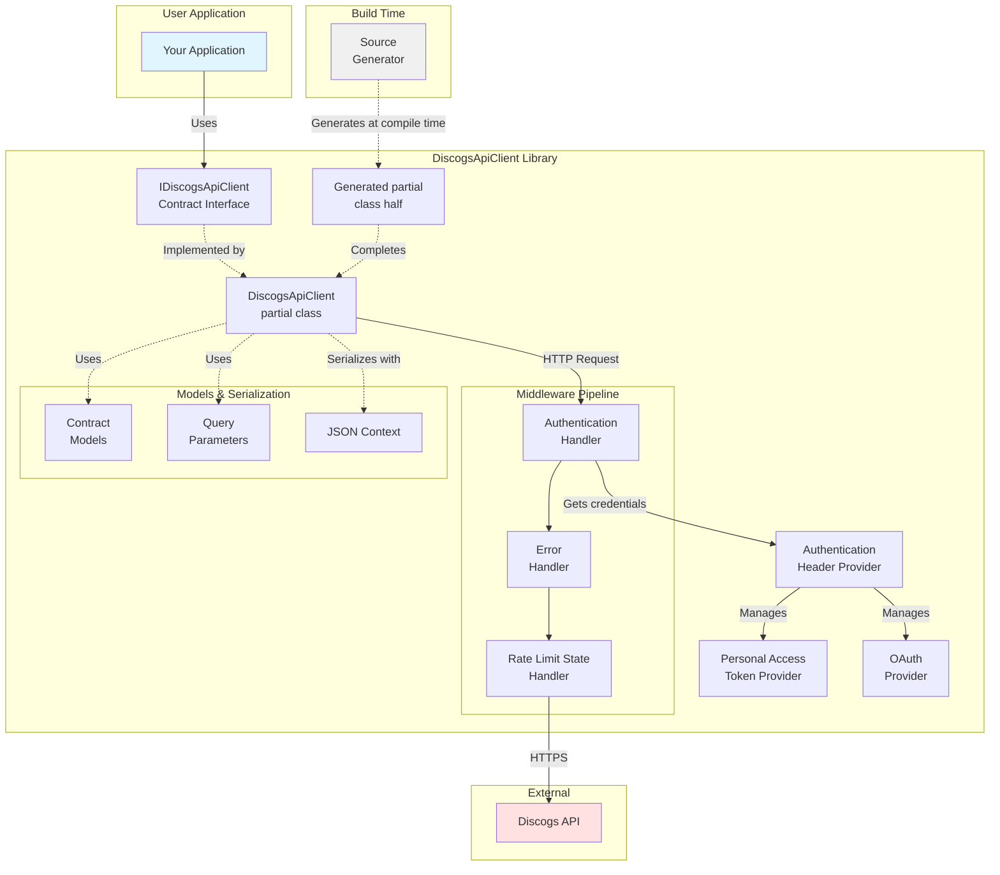
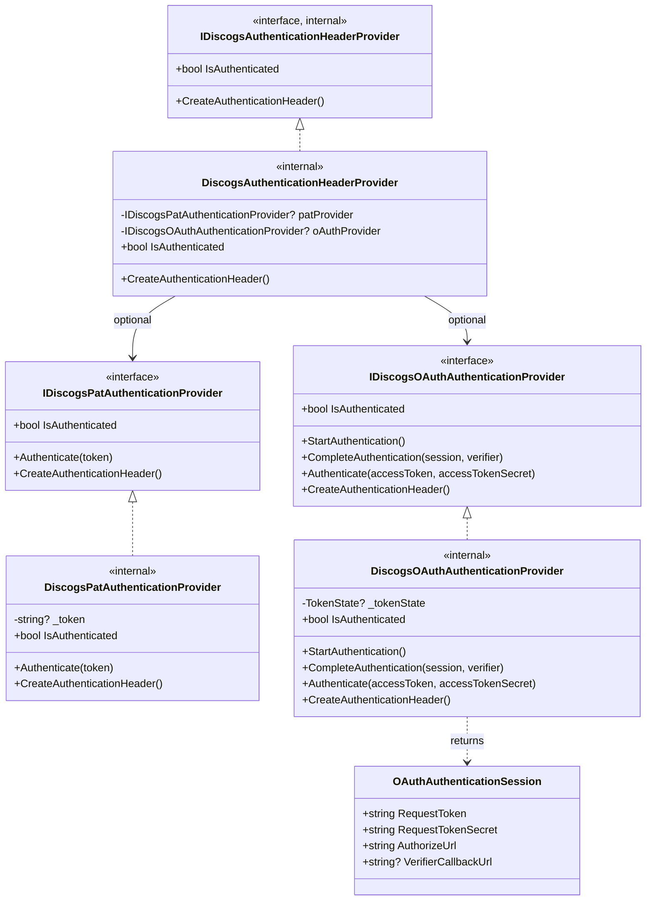
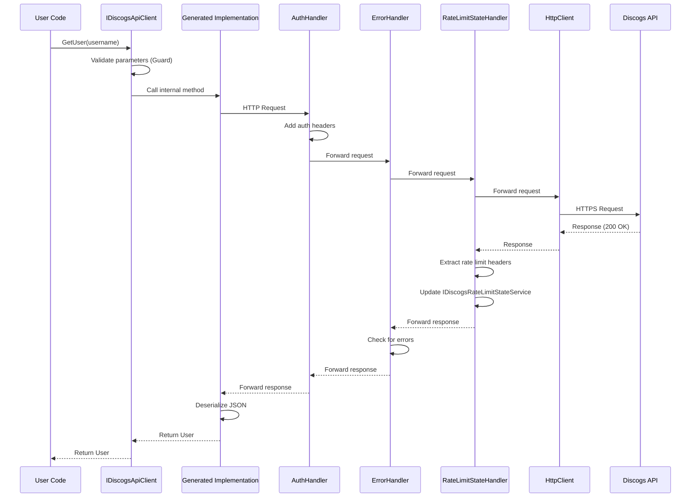
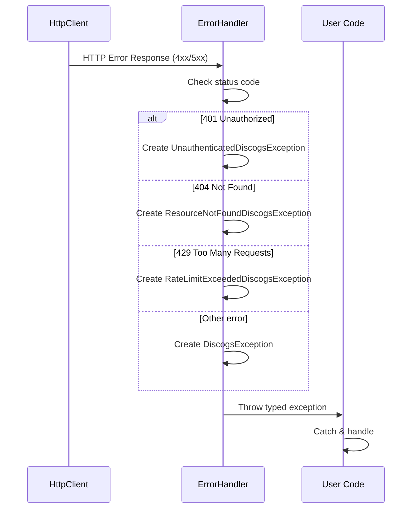

# Architecture

This document describes the architecture and design of the DiscogsApiClient library.

## Overview

DiscogsApiClient is a strongly-typed .NET library for accessing the Discogs API v2. It uses **C# Source Generators** to automatically generate HTTP client code from a partial class annotated with `[ApiClient]`, providing a type-safe and AOT-compatible API surface.

**Key Features:**
- Source Generator-based client implementation
- Multiple authentication methods (Personal Access Token, OAuth 1.0a)
- Error handling with custom exceptions
- Extensibility via middleware and DI
- Native AOT compatibility
- System.Text.Json with source-generated serialization
- Multi-targeting (.NET 6, 7, 8)

---

## High-Level Architecture


```mermaid
graph TB
    subgraph "User Application"
        App[Your Application]
    end

    subgraph "DiscogsApiClient Library"
        Interface[IDiscogsApiClient<br/>Contract Interface]
        Client[DiscogsApiClient<br/>partial class]
        Generated[Generated partial<br/>class half]
        Auth[Authentication<br/>Header Provider]
        PAT[Personal Access<br/>Token Provider]
        OAuth[OAuth<br/>Provider]

        subgraph "Middleware Pipeline"
            AH[Authentication<br/>Handler] --> EH[Error<br/>Handler]
            EH --> RLS[Rate Limit State<br/>Handler]
        end

        subgraph "Models & Serialization"
            Contract[Contract<br/>Models]
            Query[Query<br/>Parameters]
            Json[JSON Context]
        end
    end

    subgraph "Build Time"
        SG[Source<br/>Generator]
    end

    subgraph "External"
        API[Discogs API]
    end

    App -->|Uses| Interface
    Interface -.->|Implemented by| Client
    Generated -.->|Completes| Client
    Client -->|HTTP Request| AH
    RLS -->|HTTPS| API

    Client -.->|Serializes with| Json
    Client -.->|Uses| Contract
    Client -.->|Uses| Query

    Auth -->|Manages| PAT
    Auth -->|Manages| OAuth
    AH -->|Gets credentials| Auth

    SG -.->|Generates at compile time| Generated

    style App fill:#e1f5ff
    style API fill:#ffe1e1
    style SG fill:#f0f0f0
```

---

## Project Structure

```
DiscogsApiClient/
├── src/
│   ├── DiscogsApiClient/                    # Main library
│   ├── DiscogsApiClient.SourceGenerator/    # Source generator project
│   └── DiscogsApiClient.Tests/              # Unit tests
├── demo/                                     # Demo applications
│   ├── DiscogsApiClientDemo.AotConsole/
│   ├── DiscogsApiClientDemo.OAuth/
│   ├── DiscogsApiClientDemo.PersonalAccessToken/
│   ├── DiscogsApiClientDemo.PlainOAuth/
│   └── DiscogsApiClientDemo.UserToken/
└── docs/                                     # Documentation
    ├── API_COVERAGE.md                       # API endpoint coverage tracking
    └── Documentation.html                    # Discogs API reference (saved locally)
```

---

## Core Components

### 1. API Client Contract & Class (`IDiscogsApiClient` / `DiscogsApiClient`)

**Location:** `DiscogsApiClient/IDiscogsApiClient.cs`, `DiscogsApiClient/DiscogsApiClient.cs`

`IDiscogsApiClient` is a plain public contract interface defining all API operations (no attributes, no default implementations). `DiscogsApiClient` is an `internal sealed partial class` that implements it and is decorated with `[ApiClient(typeof(DiscogsJsonSerializerContext))]` to trigger source generation.

**Key Patterns:**
- The code owner writes the hand-authored partial half: the primary constructor declaring the dependencies (`HttpClient` + `DiscogsJsonSerializerContext`) and assigning them to fields, the `partial` method definitions carrying HTTP attributes (`[HttpGet]`, `[HttpPost]`, `[HttpPut]`, `[HttpDelete]`), and public validation wrappers.
- The generator emits the other partial half: the implementing `partial` method bodies plus the `Send`/`SendAsync`/`SerializeContent` helpers and route builders.
- Dependencies are discovered by **type** — any field/property of type `HttpClient`, and any field/property whose type is or derives from the context type in `[ApiClient(...)]`. Names are up to the code owner. A primary constructor may declare the dependencies as long as it assigns them to a field or property (the generator only inspects fields and properties, never constructor parameters).
- Async/await throughout with `CancellationToken` support.
- Guard clauses using native `ArgumentNullException`/`ArgumentException` throw helpers.

**Example:**
```csharp
[ApiClient(typeof(DiscogsJsonSerializerContext))]
internal sealed partial class DiscogsApiClient(HttpClient httpClient, DiscogsJsonSerializerContext jsonSerializerContext) : IDiscogsApiClient
{
    private readonly HttpClient _httpClient = httpClient;
    private readonly DiscogsJsonSerializerContext _jsonSerializerContext = jsonSerializerContext;

    [HttpGet("/users/{username}")]
    private partial Task<User> GetUserInternal(string username, CancellationToken cancellationToken);

    public async Task<User> GetUser(string username, CancellationToken cancellationToken)
    {
        ArgumentException.ThrowIfNullOrWhiteSpace(username);
        return await GetUserInternal(username, cancellationToken).ConfigureAwait(false);
    }
}
```

Endpoints that need no validation can instead be declared as a `public partial` method that directly implements the interface member; the generator supplies the body.

### 2. Source Generator (`DiscogsApiClient.SourceGenerator`)

**Location:** `DiscogsApiClient.SourceGenerator/`

An incremental source generator that analyzes the `[ApiClient]` partial class and generates the implementing partial-class half.

**Components:**
- **Parser** - Parses the annotated class, discovers the `HttpClient` and context members, and parses the `partial` API methods
- **Generators** - Generates the partial-class half, query parameter serialization, and method bodies
- **Attributes** - Custom attributes for API definition (`[ApiClient]`, `[HttpGet]`, `[Body]`, etc.)

**Generated Code:**
- The other half of the `partial` API client class (implementing partial methods)
- HTTP request construction
- URL building with route/query parameters
- Response deserialization

**Key Classes:**
- `ApiClientSourceGenerator` - Main generator entry point
- `ApiClientParser` - Parses the annotated class and discovers dependency members
- `ApiMethodParser` - Parses `partial` method declarations
- `ApiClientGenerator` - Generates the partial-class half
- `ApiMethodGenerator` - Generates HTTP method implementations
- `QueryParameterGenerator` - Generates query string serialization

### 3. Authentication System

**Location:** `DiscogsApiClient/Authentication/`

Authentication is an **explicit, single choice made at DI registration time**, mirroring
`AddAuthentication().AddJwtBearer(...)`-style ecosystem patterns. `AddDiscogsApiClient(...)` alone
registers no authentication mechanism (unauthenticated by default); consumers opt into exactly one
mechanism via `.WithPatAuthentication(...)` or `.WithOAuthAuthentication(...)`.

#### Personal Access Token

**Location:** `DiscogsApiClient/Authentication/Pat/`

**Classes:**
- `IDiscogsPatAuthenticationProvider` (public)
- `DiscogsPatAuthenticationProvider` (internal implementation, registered via DI)
- `DiscogsPatOptions` (bindable from `"Discogs:Pat"`)

Simple token-based authentication using `Authorization: Discogs token={token}` header. The token can
be supplied at DI-registration time via options/`IConfiguration` (the provider is then already
authenticated once the container is built) or later via a runtime `Authenticate(token)` call.
Consumers resolve `IDiscogsPatAuthenticationProvider` from the container — the concrete
`DiscogsPatAuthenticationProvider` type is an internal implementation detail and never referenced directly.

#### OAuth 1.0a (Plain)

**Location:** `DiscogsApiClient/Authentication/OAuth/`

**Classes:**
- `IDiscogsOAuthAuthenticationProvider` (public)
- `DiscogsOAuthAuthenticationProvider` (internal implementation, registered via DI)
- `OAuthAuthenticationSession` (public)
- `DiscogsOAuthOptions` (bindable from `"Discogs:OAuth"`; app-identity secrets only — `ConsumerKey`,
  `ConsumerSecret`, `VerifierCallbackUrl`)

Full OAuth 1.0a flow implementation:
1. Request token acquisition
2. User authorization (external browser)
3. Access token exchange using verifier

The obtained user access token/secret are **never** stored in options/configuration — they're
dynamic, per-user values returned directly to the caller from `CompleteAuthentication(...)`, and
caching them between runs (e.g. to disk or a secret store) is the consuming application's
responsibility. An app with a previously-cached token/secret pair can skip the interactive flow by
calling `Authenticate(accessToken, accessTokenSecret)` directly after resolving the provider.

**Note:** Uses plain (unencrypted) OAuth as recommended by Discogs since all requests are over HTTPS.
Consumers resolve `IDiscogsOAuthAuthenticationProvider` from the container — the concrete
`DiscogsOAuthAuthenticationProvider` type is an internal implementation detail and never referenced directly.

#### Internal composition

**Class:** `DiscogsAuthenticationHeaderProvider` (internal, implements internal `IDiscogsAuthenticationHeaderProvider`)

Composes at most one authenticated provider via two **optional, nullable** constructor
dependencies (`IDiscogsPatAuthenticationProvider?`, `IDiscogsOAuthAuthenticationProvider?`). The
built-in DI container supplies `null` for a dependency that was never registered, so the
"unauthenticated" default state falls out naturally — no sentinel/no-op registration needed. Since
`WithPatAuthentication`/`WithOAuthAuthentication` are mutually exclusive, at most one of the two is
ever non-null, so the constructor resolves and caches the single active one (typed as the internal
`IDiscogsAuthenticationProvider` shared shape) once, instead of re-checking both nullable
dependencies on every `IsAuthenticated`/`GetHeader()` call. This is the only type
`AuthenticationDelegatingHandler` depends on; it is not part of the public API.

#### Authentication Class Diagram


```mermaid
classDiagram
    class IDiscogsAuthenticationHeaderProvider {
        <<interface, internal>>
        +bool IsAuthenticated
        +CreateAuthenticationHeader()
    }

    class DiscogsAuthenticationHeaderProvider {
        <<internal>>
        -IDiscogsPatAuthenticationProvider? patProvider
        -IDiscogsOAuthAuthenticationProvider? oAuthProvider
        +bool IsAuthenticated
        +CreateAuthenticationHeader()
    }

    class IDiscogsPatAuthenticationProvider {
        <<interface>>
        +bool IsAuthenticated
        +Authenticate(token)
        +CreateAuthenticationHeader()
    }

    class DiscogsPatAuthenticationProvider {
        <<internal>>
        -string? _token
        +bool IsAuthenticated
        +Authenticate(token)
        +CreateAuthenticationHeader()
    }

    class IDiscogsOAuthAuthenticationProvider {
        <<interface>>
        +bool IsAuthenticated
        +StartAuthentication()
        +CompleteAuthentication(session, verifier)
        +Authenticate(accessToken, accessTokenSecret)
        +CreateAuthenticationHeader()
    }

    class DiscogsOAuthAuthenticationProvider {
        <<internal>>
        -TokenState? _tokenState
        +bool IsAuthenticated
        +StartAuthentication()
        +CompleteAuthentication(session, verifier)
        +Authenticate(accessToken, accessTokenSecret)
        +CreateAuthenticationHeader()
    }

    class OAuthAuthenticationSession {
        +string RequestToken
        +string RequestTokenSecret
        +string AuthorizeUrl
        +string? VerifierCallbackUrl
    }

    IDiscogsAuthenticationHeaderProvider <|.. DiscogsAuthenticationHeaderProvider
    DiscogsAuthenticationHeaderProvider --> IDiscogsPatAuthenticationProvider : optional
    DiscogsAuthenticationHeaderProvider --> IDiscogsOAuthAuthenticationProvider : optional
    IDiscogsPatAuthenticationProvider <|.. DiscogsPatAuthenticationProvider
    IDiscogsOAuthAuthenticationProvider <|.. DiscogsOAuthAuthenticationProvider
    DiscogsOAuthAuthenticationProvider ..> OAuthAuthenticationSession : returns
```

### 4. HTTP Middleware Pipeline

**Location:** `DiscogsApiClient/Middleware/`

Custom `DelegatingHandler` implementations for cross-cutting concerns:

#### `AuthenticationDelegatingHandler`
- Adds authentication headers to outgoing requests
- Delegates to active authentication provider

#### `ErrorHandlingDelegatingHandler`
- Intercepts HTTP error responses
- Translates to domain-specific exceptions
- Maps 401 → `UnauthenticatedDiscogsException`
- Maps 404 → `ResourceNotFoundDiscogsException`
- Maps 429 → `RateLimitExceededDiscogsException`

#### `RateLimitStateDelegatingHandler`
- Extracts Discogs API rate limit headers from responses
- Updates `IDiscogsRateLimitStateService` with current rate limit values
- Provides observable rate limit state for consumers to implement custom strategies
- **Positioned last in pipeline** to ensure headers are captured even from error responses

**Pipeline Order:**
```
Request → Authentication → ErrorHandling → RateLimitState → HttpClient → API
Response ← RateLimitState ← ErrorHandling ← Authentication ← HttpClient ← API
```

### 5. Contract Models

**Location:** `DiscogsApiClient/Contract/`

Data Transfer Objects (DTOs) organized by domain:
- `Artist/` - Artist and artist release models
- `Label/` - Label and label release models
- `Release/` - Release, master release, ratings, stats
- `User/` - User profile, identity, collection, wantlist
- `Search/` - Search query and result models

**Characteristics:**
- Immutable record types with init-only properties
- JSON source generation compatible
- Nullable reference types enabled
- Enum converters for string/int mapping

### 6. Serialization

**Location:** `DiscogsApiClient/DiscogsJsonSerializerContext.cs`

Uses `System.Text.Json` source generation for AOT compatibility:
- `[JsonSerializable]` attributes for all contract types
- `DiscogsJsonSerializerContext` for metadata
- Custom enum converters generated via source generator

### 7. Query Parameters

**Location:** `DiscogsApiClient/QueryParameters/`

Strongly-typed query parameter models:
- `PaginationQueryParameters` - Page/per_page
- `SearchQueryParameters` - Database search filters
- `CollectionFolderReleaseSortQueryParameters` - Collection sorting
- `ArtistReleaseSortQueryParameters` - Artist release sorting
- `MasterReleaseVersionFilterQueryParameters` - Master version filtering

Serialized to query strings by source generator.

### 8. Dependency Injection

**Location:** `DiscogsApiClient/ServiceCollectionExtensions.cs`

The `AddDiscogsApiClient` extension methods live in the `Microsoft.Extensions.DependencyInjection`
namespace so they surface in IntelliSense without an extra `using`. Three overloads are provided,
and `WithPatAuthentication`/`WithOAuthAuthentication` mirror the same three call patterns so
authentication options can be configured exactly the same way as the client itself:

```csharp
// A) Code-based configuration.
services.AddDiscogsApiClient(options =>
{
    options.BaseUrl = "https://api.discogs.com";
    options.UserAgent = "MyApp/1.0";
})
.WithPatAuthentication(options => options.Token = "...");
// or: .WithOAuthAuthentication(options => { options.ConsumerKey = "..."; options.ConsumerSecret = "..."; });

// B) Bind from IConfiguration (e.g. appsettings.json "Discogs" section).
services.AddDiscogsApiClient(configuration.GetSection(DiscogsApiClientOptions.SectionName))
    .WithPatAuthentication(configuration.GetSection(DiscogsPatOptions.SectionName));
// or (auto-bind from a registered IConfiguration, no explicit section):
services.AddDiscogsApiClient(configuration.GetSection(DiscogsApiClientOptions.SectionName))
    .WithPatAuthentication(); // Token bound from "Discogs:Pat" if IConfiguration is registered.

// C) DI-aware configuration (delegate receives the IServiceProvider).
services.AddDiscogsApiClient((serviceProvider, options) =>
{
    options.UserAgent = serviceProvider.GetRequiredService<IAppInfo>().UserAgent;
})
.WithPatAuthentication((serviceProvider, options) => options.Token = serviceProvider.GetRequiredService<ITokenStore>().Token);
```

**Configuration & options pattern:**
- Options flow through `IOptions<DiscogsApiClientOptions>` (no raw singleton).
- The delegate overloads (A & C) first bind the `DiscogsApiClientOptions.SectionName` (`"Discogs"`)
  section **if** an `IConfiguration` is registered, then apply the delegate on top (code overrides config).
- Validation is reflection-free and AOT-safe via a hand-written `IValidateOptions<DiscogsApiClientOptions>`
  (`DiscogsApiClientOptionsValidator`) and runs at startup through `.ValidateOnStart()`. It enforces
  required `BaseUrl`/`UserAgent` and that URL values are constructable absolute URIs.
- `.WithPatAuthentication(...)`/`.WithOAuthAuthentication(...)` each bind their own dedicated options
  type (`DiscogsPatOptions` from `"Discogs:Pat"`, `DiscogsOAuthOptions` from `"Discogs:OAuth"`) the
  same way, through the same three overload patterns (A/B/C above), each with their own
  `IValidateOptions<T>` + `.ValidateOnStart()`. Calling both on the same `IServiceCollection` throws
  `InvalidOperationException` — only one mechanism may be active.
- An optional `Action<IHttpClientBuilder>? configureClient` hook on every `AddDiscogsApiClient` overload
  lets callers add their own handlers; they sit **outermost** in the pipeline.

**OAuth provider's HTTP client:** `DiscogsOAuthAuthenticationProvider` holds mutable token state and must
be a DI **singleton** so the instance a consumer authenticates via `StartAuthentication`/`CompleteAuthentication`/
`Authenticate` is the same instance `DiscogsAuthenticationHeaderProvider` reads from. `AddHttpClient<TClient,
TImplementation>()` always registers the typed client as **transient**, which would defeat that. Instead, the
provider takes a plain `IHttpClientFactory` in its constructor and creates its own named client from it
(`httpClientFactory.CreateClient(HttpClientName)`), where `HttpClientName` is a `public const string` on
`DiscogsOAuthAuthenticationProvider` itself (`nameof(DiscogsOAuthAuthenticationProvider)`) — not a
loosely-related string owned by `ServiceCollectionExtensions`. `WithOAuthAuthentication` only needs to
`AddHttpClient(DiscogsOAuthAuthenticationProvider.HttpClientName)` (to configure the named client) and
`TryAddSingleton<IDiscogsOAuthAuthenticationProvider, DiscogsOAuthAuthenticationProvider>()` — the container
resolves the constructor's `IHttpClientFactory`/`IOptions<DiscogsOAuthOptions>` automatically, no manual
factory delegate needed.

**Idempotency:** infrastructure services are registered with `TryAdd*`, so calling `AddDiscogsApiClient`
twice is safe and callers can pre-register overrides.

**Handler pipeline (outer → inner):** `[user handlers] → Error → Auth → RateLimit`. `RateLimitStateDelegatingHandler`
is innermost so it captures rate-limit headers from every response before `ErrorHandlingDelegatingHandler`
can translate a non-success status into a `DiscogsException`.

**Registered Services:**
- `IDiscogsApiClient` (typed `HttpClient`)
- `IDiscogsAuthenticationHeaderProvider` (internal, Singleton) — always registered
- `IDiscogsPatAuthenticationProvider` / `IDiscogsOAuthAuthenticationProvider` (Singleton) — only
  registered when `.WithPatAuthentication(...)` / `.WithOAuthAuthentication(...)` is called; neither
  is registered by default (unauthenticated client)
- `IDiscogsRateLimitStateService` / `IDiscogsRateLimitStateUpdateService` (single shared Singleton)
- Middleware handlers (Transient)

---

## Design Patterns

### 1. Source Generator Pattern
- **What:** Compile-time code generation from a `[ApiClient]` partial class
- **Why:** Type safety, AOT compatibility, reduced reflection overhead
- **Trade-off:** Longer compile times, generated code debugging

### 2. Middleware Pattern (Delegating Handlers)
- **What:** Chain of responsibility for HTTP request/response processing
- **Why:** Separation of concerns, composable pipeline
- **Implementation:** ASP.NET Core `DelegatingHandler`

### 3. Optional-Dependency Composition Pattern
- **What:** `DiscogsAuthenticationHeaderProvider` composes at most one authenticated provider via
  two optional, nullable constructor dependencies
- **Why:** The "unauthenticated by default" state falls out naturally from unregistered DI
  dependencies resolving to `null` — no sentinel/no-op provider type is needed
- **Alternative:** A swappable facade with runtime-mutable "last authenticated wins" state (the
  previous design) — rejected because it allowed conflicting/half-configured auth state

### 4. Guard Clause Pattern
- **What:** Early parameter validation in public methods
- **Why:** Fail fast, clear error messages
- **Library:** `CommunityToolkit.Diagnostics`

### 5. Internal/Public Method Pair
- **What:** Internal method with attributes, public wrapper with validation
- **Why:** Separates generated code concerns from validation logic
- **Pattern:**
  ```csharp
  [HttpGet("...")]
  internal Task<T> InternalMethod(...);

  public async Task<T> PublicMethod(...)
  {
      // Validation
      return await InternalMethod(...);
  }
  ```

---

## Data Flow

### Typical Request Flow


```mermaid
sequenceDiagram
    participant User as User Code
    participant API as IDiscogsApiClient
    participant Gen as Generated Implementation
    participant Auth as AuthHandler
    participant Error as ErrorHandler
    participant RLS as RateLimitStateHandler
    participant HTTP as HttpClient
    participant Discogs as Discogs API

    User->>API: GetUser(username)
    API->>API: Validate parameters (Guard)
    API->>Gen: Call internal method
    Gen->>Auth: HTTP Request
    Auth->>Auth: Add auth headers
    Auth->>Error: Forward request
    Error->>RLS: Forward request
    RLS->>HTTP: Forward request
    HTTP->>Discogs: HTTPS Request
    Discogs-->>HTTP: Response (200 OK)
    HTTP-->>RLS: Response
    RLS->>RLS: Extract rate limit headers
    RLS->>RLS: Update IDiscogsRateLimitStateService
    RLS-->>Error: Forward response
    Error->>Error: Check for errors
    Error-->>Auth: Forward response
    Auth-->>Gen: Forward response
    Gen->>Gen: Deserialize JSON
    Gen-->>API: Return User
    API-->>User: Return User
```

### Error Flow


```mermaid
sequenceDiagram
    participant HTTP as HttpClient
    participant Error as ErrorHandler
    participant User as User Code

    HTTP->>Error: HTTP Error Response (4xx/5xx)
    Error->>Error: Check status code

    alt 401 Unauthorized
        Error->>Error: Create UnauthenticatedDiscogsException
    else 404 Not Found
        Error->>Error: Create ResourceNotFoundDiscogsException
    else 429 Too Many Requests
        Error->>Error: Create RateLimitExceededDiscogsException
    else Other error
        Error->>Error: Create DiscogsException
    end

    Error->>User: Throw typed exception
    User->>User: Catch & handle
```

---

## Key Technologies

| Technology | Purpose | Version |
|------------|---------|---------|
| C# | Primary language | 12+ |
| .NET | Target frameworks | 8, 9, 10 |
| System.Text.Json | Serialization | Built-in |
| Source Generators | Code generation | Roslyn |
| HttpClient | HTTP communication | Built-in |
| Microsoft.Extensions.Http | HttpClient factory | 10.0.8 |

---

## Extension Points

### Adding New Endpoints

1. **Define a `partial` method** on the `DiscogsApiClient` class with an HTTP attribute, plus a public wrapper (or a `public partial` method when no validation is needed):
   ```csharp
   [HttpGet("/new/endpoint/{id}")]
   private partial Task<ResponseType> GetNewEndpointInternal(int id, CancellationToken ct);

   public async Task<ResponseType> GetNewEndpoint(int id, CancellationToken ct)
   {
       ArgumentOutOfRangeException.ThrowIfNegativeOrZero(id);
       return await GetNewEndpointInternal(id, ct).ConfigureAwait(false);
   }
   ```

   Add the matching method signature to the `IDiscogsApiClient` contract interface.

2. **Create contract models** in `Contract/` folder

3. **Add JSON serialization** to `DiscogsJsonSerializerContext`:
   ```csharp
   [JsonSerializable(typeof(ResponseType))]
   ```

4. **Update API_COVERAGE.md** to track implementation status

### Custom Authentication

Implement `IAuthenticationProvider` (hypothetical, not exposed) or extend existing providers.

### Custom Middleware

Add custom `DelegatingHandler` to the pipeline in `ServiceCollectionExtensions`:
```csharp
builder.AddHttpMessageHandler<CustomDelegatingHandler>();
```

---

## Testing Strategy

**Location:** `DiscogsApiClient.Tests/`

- **Unit tests** for individual components
- **Integration tests** against real API (with test credentials)
- **Mock HTTP responses** for offline testing
- Test framework: xUnit (inferred from project structure)

---

## AOT Compatibility

The library is designed for Native AOT compatibility:

- ✅ No reflection-based serialization
- ✅ Source-generated JSON serialization
- ✅ Source-generated HTTP client
- ✅ `IsAotCompatible` set to `true`
- ✅ `JsonSerializerIsReflectionEnabledByDefault` set to `false`

---

## Performance Considerations

1. **Connection Pooling:** HttpClient factory provides connection reuse
2. **Async/Await:** All I/O operations are async throughout
3. **Source Generation:** No runtime reflection overhead
4. **Minimal Allocations:** Uses `Span<T>` and value types where appropriate

---

## Security Considerations

1. **HTTPS Only:** All API communication over HTTPS
2. **Token Storage:** Tokens stored in-memory, not persisted by library
3. **OAuth Plain:** Acceptable since transport is encrypted (Discogs recommendation)
4. **No Secrets in Code:** Consumer keys/secrets passed via configuration
5. **Guard Clauses:** Input validation prevents injection attacks

---

## Future Enhancements

See `API_COVERAGE.md` for missing API endpoints.

**Potential Improvements:**
- Marketplace/Inventory functionality
- User Lists support
- Contribution tracking
- Advanced collection management (custom fields)
- Retry policies with Polly
- Telemetry/OpenTelemetry support
- Response caching

---

## References

- [Discogs API Documentation](https://www.discogs.com/developers/)
- [API Coverage Tracking](./API_COVERAGE.md)
- [Source Generators Documentation](https://learn.microsoft.com/en-us/dotnet/csharp/roslyn-sdk/source-generators-overview)
- [System.Text.Json Source Generation](https://learn.microsoft.com/en-us/dotnet/standard/serialization/system-text-json/source-generation)
